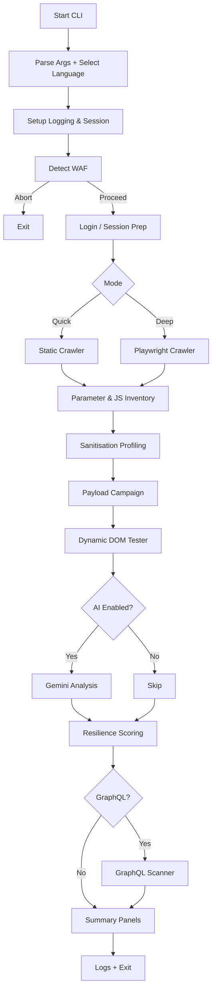
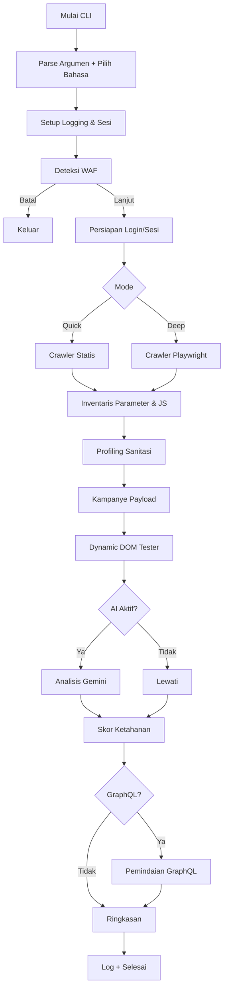

<div align="center">


</div>

---

# XSS Scanner – English Edition

## Table of Contents
1. [Introduction](#1-introduction)
2. [Key Capabilities](#2-key-capabilities)
3. [Architecture Overview](#3-architecture-overview)
4. [End-to-End Processing Flow](#4-end-to-end-processing-flow)
5. [Installation & Environment Preparation](#5-installation--environment-preparation)
6. [Configuration & Feature Flags](#6-configuration--feature-flags)
7. [Operating the CLI](#7-operating-the-cli)
8. [WAF-Aware Operation](#8-waf-aware-operation)
9. [AI-Assisted Analysis](#9-ai-assisted-analysis)
10. [Resilience Scoring & Reporting](#10-resilience-scoring--reporting)
11. [Logs, Data Hygiene, and Exporting](#11-logs-data-hygiene-and-exporting)
12. [Troubleshooting & FAQ](#12-troubleshooting--faq)
13. [Roadmap & Contribution Guidelines](#13-roadmap--contribution-guidelines)
14. [Legal Notice](#14-legal-notice)

---

## 1. Introduction
The MerdekaSiberLab **XSS Scanner** is a professional-grade toolkit for discovering, validating, and prioritising Cross-Site Scripting (XSS) weaknesses on modern web applications. It drives both static and dynamic crawling, understands common WAF responses, orchestrates payload campaigns, and optionally leverages Google Gemini (GenAI) to summarise findings.

Use it when you require:
- repeatable XSS reconnaissance across SSR and SPA properties;
- contextual payload adaptation against sanitisation patterns;
- runtime DOM inspection and resilience scoring;
- guided workflows suitable for red teams, offensive engineers, and DevSecOps squads.

## 2. Key Capabilities
| Capability | Description |
|------------|-------------|
| Hybrid Crawling | Combines HTML parsing with Playwright-backed exploration to cover SPAs, gated flows, and lazy-loaded content. |
| Context-Aware Payload Engine | `payload_strategy.py` fingerprints sanitisation behaviour and injects context-appropriate payloads (HTML, attributes, JS strings, URLs, CSS, SVG). |
| Dynamic DOM Tester | `dynamic_dom_tester.py` captures runtime sinks, event handler attachments, DOM mutations, and headless browser alerts to validate execution paths. |
| WAF Detection & Bypass Guidance | `waf_detector.py` inspects headers, cookies, bodies to identify vendors, propose throttling, and feed bypass hints to the payload strategy. |
| Gemini AI Integration | `ai_analysis.py` packages HTML, CSP information, and prioritised JS snippets for Google GenAI, returning ranked sinks, exploit ladders, mitigation plans, and validation steps. |
| GraphQL Scanner | `graphql_scanner.py` enumerates endpoints, tests introspection, and fuzzes resolvers for XSS vectors. |
| Resilience Scoring | `tester.py` + `resilience.py` consolidate CSP/Trusted Types probes, confirmed payloads, and sink coverage into a quantitative resilience score with actionable checklist. |
| Multilingual CLI | `i18n.py` powers an English/Indonesian command experience (language selected at startup). |

## 3. Architecture Overview
```
cli.py                  # User interface, orchestration, i18n hooks
main.py                 # Minimal entry point wrapper
network.py              # Session management, request pacing, anti-WAF camo
waf_detector.py         # Fingerprinting heuristics, bypass plans
payload_strategy.py     # Payload catalogue + sanitiser fingerprint logic
dynamic_dom_tester.py   # Playwright instrumentation and sink harvesting
tester.py               # Payload execution pipelines + resilience scoring
ai_analysis.py          # Gemini prompting, sectioned Rich panels
graphql_scanner.py      # Endpoint discovery, introspection, resolver fuzzing
crawler/                # BFS crawler + Playwright advanced crawler variants
parsers/                # Context extraction (HTML, attributes, JS, DOM)
docs/                   # Documentation & evaluation artefacts
waf_fingerprints.yaml   # WAF vendor signatures (headers/body/cookies)
i18n.py                 # Translation registry and helper utilities
```

### 3.1 Module Responsibilities
| Module | Primary Responsibility | Notable Inputs | Outputs |
|--------|------------------------|---------------|---------|
| `cli.py` | Operator workflow, selection prompts, console rendering | CLI args, i18n labels, network/taster modules | Rich tables/panels, orchestrated scan flow |
| `network.py` | HTTP session, retry, jitter, throttle | Requests session, WAF profile | Response objects, paced request loops |
| `payload_strategy.py` | Generate payload campaigns per context | Sanitiser fingerprints, WAF hints | Payload templates for `tester.py` |
| `dynamic_dom_tester.py` | Collect runtime sinks via Playwright | Target URLs, payload hooks | Sink inventory, runtime findings |
| `tester.py` | Execute payloads, collect resilience evidence | Payload sets, DOM findings | Confirmed XSS hits, resilience summary |
| `ai_analysis.py` | Build Gemini prompts, parse responses | HTML snapshots, JS snippets, runtime data | Sectioned AI panels, JS summaries |
| `graphql_scanner.py` | GraphQL discovery & fuzzing | Base URL, request session | Endpoint list, introspection report |

## 4. End-to-End Processing Flow
The scanner executes a structured pipeline:

1. **Argument Parsing & Language Selection** – CLI receives options, prompts for language via `_prompt_language_choice()`.
2. **Logging Setup** – Rich console + file handler initialised with verbosity controlled by `--summary-only`.
3. **Network Session** – `network.session` configured (cookies, headers, proxies). Optional `--cookie` injection occurs here.
4. **WAF Detection (Optional)** – `waf_detector.detect()` performs HEAD/GET probes, matches vendor signatures, and suggests safe RPS/backoff. Operator decides whether to continue.
5. **Authentication (Optional)** – Either manual headful login (`--manual-login`) or scripted credentials in deep mode set session state.
6. **Crawling**
   - **Quick Mode**: HTML BFS crawler enumerates anchors/forms/scripts up to `--depth` and `--max-urls`.
   - **Deep Mode**: Playwright-based crawler handles SPA routes, navigations, dynamic content.
7. **Parameter & JS Inventory** – `tester.py` collates parameter candidates; `crawler` collects external JS URLs for prioritisation.
8. **Sanitisation Profiling** – For each parameter, baseline reflection tests generate a fingerprint summarised via `_render_sanitizer_overview()`.
9. **Payload Campaign** – `payload_strategy.py` and `tester.py` execute multi-phase payloads per context, recording confirmed hits.
10. **Dynamic DOM Testing** – Playwright renders candidate pages, capturing sinks/events/alerts into `runtime_findings`.
11. **AI Analysis (Optional)** – When API key is provided and user opts in, `ai_analysis.py` sends curated HTML/JS/runtime data to Gemini, rendering Rich panels for sinks, exploit paths, mitigations.
12. **Resilience Scoring** – `tester.resilience_summary()` aggregates protective signals (CSP, Trusted Types, mutated sinks) into a numerical score and checklist.
13. **GraphQL Scanning (Optional)** – `graphql_scanner` enumerates endpoints, introspects schemas, and fuzzes resolver arguments.
14. **Final Summary & Logs** – CLI displays executed payloads, resilience score, AI summaries, then writes detailed logs into `logs/`.

### 4.1 Flow Diagram


## 5. Installation & Environment Preparation
### 5.1 Clone & Virtual Environment
```bash
git clone https://github.com/merdekasiberlab/xsscanner.git
cd xsscanner
python -m venv .venv
# Windows PowerShell". .venv/Scripts/Activate.ps1"
# macOS/Linux
source .venv/bin/activate
```

### 5.2 Install Requirements
```bash
pip install --upgrade pip
pip install -r requirements.txt
python -m playwright install chromium
```

### 5.3 Optional Developer Tooling
```bash
pip install -r requirements-dev.txt
ruff check .
mypy .
pytest -m "not playwright"
```

### 5.4 Environment Variables
| Variable | Purpose |
|----------|---------|
| `GENAI_API_KEY` | Google GenAI key for Gemini integration. |
| `HTTP_PROXY` / `HTTPS_PROXY` | Proxy configuration for outbound requests. |
| `XSSCANNER_USER_AGENT` | Override default scanning user agent string. |

## 6. Configuration & Feature Flags
- `config.py`: houses crawler depth defaults, max URL limits, log file paths.
- `waf_fingerprints.yaml`: extend to recognise additional vendors or custom appliances.
- `payloads.yml`: supply custom payload sets organised by context.
- `i18n.py`: add translations for new console strings.

## 7. Operating the CLI
### 7.1 Language Prompt
Upon launch the CLI displays available languages (English/Indonesian). Responses persist for the current run.

### 7.2 Core Command Syntax
```bash
python main.py [OPTIONS] <target_url>
```

### 7.3 Frequently Used Options
| Flag | Description |
|------|-------------|
| `--mode {quick,deep}` | Choose between static or Playwright crawler. |
| `--max-urls N` | Limit total discovered URLs. |
| `--depth N` | Recursion depth guard for the crawler. |
| `--payloads FILE` | Merge payloads from YAML file. |
| `--cookie "name=value; ..."` | Inject session cookies. |
| `--manual-login` | Launch headful Playwright for manual authentication. |
| `--login-url URL` | Login page used with manual login capture. |
| `--username`, `--password` | Credentials for scripted login (deep mode). |
| `--user-selector`, `--pass-selector`, `--submit-selector` | Customise login form selectors. |
| `--graphql` | Enable GraphQL endpoint reconnaissance. |
| `--api-key KEY` | Supply Google GenAI key (overrides env variable). |
| `--summary-only` | Suppress verbose process logs until final summary. |
| `--workers N` | Set thread pool size for payload execution. |
| `--insecure` | Disable TLS verification (use with caution). |

### 7.4 Example Workflows
1. **Quick reconnaissance**
   ```bash
   python main.py --mode quick --max-urls 60 --depth 4 https://target.tld
   ```
2. **Deep scan + manual login + GraphQL**
   ```bash
   python main.py \
     --mode deep \
     --manual-login \
     --login-url https://portal.tld/login \
     --cookie-file corp-session.json \
     --graphql \
     --max-urls 150 \
     --depth 6 \
     https://portal.tld
   ```
3. **AI triage**
   ```bash
   set GENAI_API_KEY=your-google-genai-key
   python main.py --mode deep --api-key %GENAI_API_KEY% https://app.tld
   ```

### 7.5 Interacting with JS Analysis Menu
After parameter testing, CLI prints a ranked table of external JS files (score based on sinks, contexts, size). Operator may:
- View quick summary (sink labels and snippets).
- Run AI analysis on selected files (Gemini required).
- Skip files individually.

## 8. WAF-Aware Operation
- Detected vendor information includes origin, confidence, challenge type (JS, CAPTCHA), safe RPS, and backoff recommendations.
- CLI prompts whether to continue; rejecting aborts the scan.
- Payload strategy adapts (short payloads, avoidance of inline handlers) based on vendor metadata.
- `network.py` enforces throttle globally to minimise blocking.

## 9. AI-Assisted Analysis
- `ai_analysis.py` builds multi-part prompts containing:
  - Prettified HTML (trimmed to `max_html_bytes`).
  - Sanitiser summary map.
  - Runtime sink findings.
  - Inline/external JS snippets prioritised by sink density.
- Rich output sections include summary, evidence, exploit paths, payload ladders, mitigations, and validation steps.
- Users can rerun analysis with refreshed JS or ask follow-up questions directly from the CLI.

## 10. Resilience Scoring & Reporting
- Score (0–100) reflects presence of defences (CSP, Trusted Types, DOM sanitisation) versus confirmed payloads.
- Checklist summarises actionable improvements (e.g., enable nonce-based CSP, enforce Trusted Types).
- Pairs with AI summaries for executive reporting.

## 11. Logs, Data Hygiene, and Exporting
- Logs reside in `logs/` (per-run timestamped files). Clear directory before distribution.
- Playwright storage (`cookies.json`, storage states) may contain secrets—store securely.
- Export AI panels or resilience outputs by copying console output or redirecting CLI to a log file (`python main.py ... | tee run.log`).

## 12. Troubleshooting & FAQ
| Problem | Resolution |
|---------|------------|
| WAF fingerprint not detected | Extend `waf_fingerprints.yaml` with new header/body signatures. |
| Playwright launch failure | Reinstall browsers (`python -m playwright install chromium`). |
| Gemini module import error | `pip install google-genai` or run without `--api-key`. |
| Excessive false positives | Review context manually, tune payload sets in `payloads.yml`. |
| Scan too slow due to WAF | Accept throttle prompts, lower `--max-urls`, or run in quick mode first. |
| Logs locked on Windows | Stop the scan (Ctrl+C); handles release on exit. |

## 13. Roadmap & Contribution Guidelines
- Planned enhancements: automated OAST callbacks, remote fingerprint feeds, HTML/SARIF report exporters, CI smoke-test pipeline.
- Contributions via pull request are welcome; please run `ruff`, `mypy`, and relevant tests before submitting.
- Extend translations in `i18n.py` when adding new console output.

## 14. Legal Notice
Use this toolkit only against systems you own or have explicit written permission to test. You are responsible for complying with applicable laws, regulations, and contracts. MerdekaSiberLab and contributors accept no liability for misuse or resulting damages.

---

# XSS Scanner – Versi Bahasa Indonesia

## Daftar Isi
1. [Pendahuluan](#1-pendahuluan)
2. [Kemampuan Utama](#2-kemampuan-utama)
3. [Gambaran Arsitektur](#3-gambaran-arsitektur)
4. [Alur Proses Ujung-ke-Ujung](#4-alur-proses-ujung-ke-ujung)
5. [Instalasi & Persiapan Lingkungan](#5-instalasi--persiapan-lingkungan)
6. [Konfigurasi & Flag Fitur](#6-konfigurasi--flag-fitur)
7. [Mengoperasikan CLI](#7-mengoperasikan-cli)
8. [Operasi Sadar-WAF](#8-operasi-sadar-waf)
9. [Analisis Berbantuan AI](#9-analisis-berbantuan-ai)
10. [Skor Ketahanan & Pelaporan](#10-skor-ketahanan--pelaporan)
11. [Log, Kebersihan Data, dan Ekspor](#11-log-kebersihan-data-dan-ekspor)
12. [Pemecahan Masalah & FAQ](#12-pemecahan-masalah--faq)
13. [Rencana & Panduan Kontribusi](#13-rencana--panduan-kontribusi)
14. [Catatan Hukum](#14-catatan-hukum)

---

## 1. Pendahuluan
**XSS Scanner** dari MerdekaSiberLab merupakan toolkit profesional untuk menemukan, memvalidasi, dan memprioritaskan kerentanan Cross-Site Scripting (XSS) pada aplikasi web modern. Toolkit ini menggabungkan crawling statis-dinamis, memahami respon WAF, mengeksekusi kampanye payload, dan (opsional) memanfaatkan Google Gemini untuk merangkum temuan.

Gunakan alat ini ketika Anda membutuhkan:
- rekonsiliasi XSS yang dapat diulang pada aplikasi SSR maupun SPA;
- penyesuaian payload terhadap pola sanitasi yang terdeteksi;
- inspeksi DOM runtime beserta penilaian ketahanan;
- alur kerja terarah bagi red team, engineer keamanan ofensif, dan tim DevSecOps.

## 2. Kemampuan Utama
| Kemampuan | Deskripsi |
|-----------|-----------|
| Crawling Hibrida | Mengombinasikan parsing HTML dengan eksplorasi Playwright untuk menaklukkan SPA, alur login, dan konten dinamis. |
| Mesin Payload Kontekstual | `payload_strategy.py` menandai perilaku sanitasi (HTML, atribut, string JS, URL, CSS, SVG) dan menyiapkan payload yang sesuai konteks. |
| Dynamic DOM Tester | `dynamic_dom_tester.py` merekam sink runtime, event handler, mutasi DOM, serta alert headless untuk memverifikasi jalur eksekusi. |
| Deteksi WAF & Panduan Bypass | `waf_detector.py` memeriksa header, cookie, body untuk mengenali vendor, menyarankan throttle, dan mengirim hint ke mesin payload. |
| Integrasi Gemini AI | `ai_analysis.py` menyusun prompt HTML, informasi CSP, serta snippet JS prioritas untuk Google GenAI; menghasilkan panel ringkas berisi sink, jalur eksploit, mitigasi, dan langkah validasi. |
| Pemindaian GraphQL | `graphql_scanner.py` memetakan endpoint, melakukan introspeksi, dan melakukan fuzzing resolver guna mencari vektor XSS. |
| Skor Ketahanan | `tester.py` + `resilience.py` menggabungkan sinyal proteksi (CSP, Trusted Types, sink termutasi) ke dalam skor numerik lengkap dengan daftar tindakan. |
| CLI Multibahasa | `i18n.py` menyediakan pengalaman perintah dalam bahasa Indonesia/Inggris (dipilih saat startup). |

## 3. Gambaran Arsitektur
```
cli.py                  # Antarmuka operator, orkestrasi, i18n
main.py                 # Pembungkus entry point minimal
network.py              # Manajemen sesi, pacing request, anti-WAF camo
waf_detector.py         # Heuristik fingerprint vendor + saran bypass
payload_strategy.py     # Katalog payload + logika fingerprint sanitiser
dynamic_dom_tester.py   # Instrumentasi Playwright dan harvesting sink
tester.py               # Pipeline eksekusi payload + skor ketahanan
ai_analysis.py          # Penyusunan prompt Gemini & panel Rich
graphql_scanner.py      # Penemuan endpoint, introspeksi, fuzzing resolver
crawler/                # BFS crawler + varian crawler Playwright
parsers/                # Ekstraksi konteks (HTML, atribut, JS, DOM)
docs/                   # Dokumentasi & artefak evaluasi
waf_fingerprints.yaml   # Pustaka fingerprint WAF yang didukung
i18n.py                 # Registry terjemahan dan utilitas bantu
```

### 3.1 Tanggung Jawab Modul
| Modul | Tanggung Jawab Utama | Input Penting | Output |
|-------|----------------------|--------------|--------|
| `cli.py` | Alur kerja operator, prompt pilihan, rendering console | Argumen CLI, label i18n, modul jaringan/penguji | Tabel/panel Rich, hasil orkestrasi pindai |
| `network.py` | Sesi HTTP, retry, jitter, throttle | Session requests, profil WAF | Objek respons, loop request terpacing |
| `payload_strategy.py` | Menghasilkan kampanye payload per konteks | Fingerprint sanitasi, hint WAF | Template payload untuk `tester.py` |
| `dynamic_dom_tester.py` | Mengumpulkan sink runtime via Playwright | URL target, hook payload | Inventori sink, temuan runtime |
| `tester.py` | Eksekusi payload, agregasi bukti ketahanan | Set payload, temuan DOM | Hit XSS terkonfirmasi, ringkasan ketahanan |
| `ai_analysis.py` | Menyusun prompt Gemini, memparsing respons | Snapshot HTML, snippet JS, data runtime | Panel AI terstruktur, ringkasan JS |
| `graphql_scanner.py` | Penemuan & fuzzing GraphQL | URL dasar, session request | Daftar endpoint, laporan introspeksi |

## 4. Alur Proses Ujung-ke-Ujung
1. **Parsing Argumen & Pemilihan Bahasa** – CLI menerima opsi dan memanggil `_prompt_language_choice()`.
2. **Setup Logging** – Rich console + file handler diinisialisasi; `--summary-only` mengendalikan verbositas.
3. **Sesi Jaringan** – `network.session` dikonfigurasi (cookie, header, proxy). `--cookie` disuntikkan di tahap ini.
4. **Deteksi WAF (Opsional)** – `waf_detector.detect()` menjalankan probe HEAD/GET, mencocokkan vendor, dan memberi saran RPS/backoff. Operator memutuskan lanjut atau berhenti.
5. **Autentikasi (Opsional)** – Bisa via login headful (`--manual-login`) atau kredensial scripted (mode deep).
6. **Crawling**
   - **Mode Quick**: crawler BFS HTML mengumpulkan tautan/form/script hingga batas `--depth` dan `--max-urls`.
   - **Mode Deep**: crawler Playwright menavigasi route SPA, konten dinamis, serta state kompleks.
7. **Inventaris Parameter & JS** – `tester.py` mengkurasi kandidat parameter; crawler mengumpulkan URL JS eksternal untuk diprioritaskan.
8. **Profiling Sanitasi** – Setiap parameter diuji pemantulan baseline guna menyusun fingerprint (`_render_sanitizer_overview()`).
9. **Kampanye Payload** – `payload_strategy.py` dan `tester.py` mengeksekusi payload multi-fase sesuai konteks.
10. **Dynamic DOM Testing** – Playwright merender halaman kandidat, mencatat sink/event/alert pada `runtime_findings`.
11. **Analisis AI (Opsional)** – Bila API key tersedia dan pengguna menyetujui, `ai_analysis.py` mengirim HTML/JS/temuan runtime ke Gemini untuk panel ringkas.
12. **Penilaian Ketahanan** – `tester.resilience_summary()` menggabungkan sinyal proteksi menjadi skor 0–100 dengan daftar tindakan.
13. **Pemindaian GraphQL (Opsional)** – `graphql_scanner` memetakan endpoint, introspeksi skema, dan melakukan fuzzing resolver.
14. **Ringkasan Akhir & Log** – CLI menampilkan payload tereksekusi, skor ketahanan, panel AI, lalu menulis log terperinci ke `logs/`.

### 4.1 Diagram Alir


## 5. Instalasi & Persiapan Lingkungan
### 5.1 Kloning & Virtual Environment
```bash
git clone https://github.com/merdekasiberlab/xsscanner.git
cd xsscanner
python -m venv .venv
# Windows PowerShell". .venv/Scripts/Activate.ps1"
# macOS/Linux
source .venv/bin/activate
```

### 5.2 Instalasi Dependensi
```bash
pip install --upgrade pip
pip install -r requirements.txt
python -m playwright install chromium
```

### 5.3 Tooling Opsional untuk Pengembang
```bash
pip install -r requirements-dev.txt
ruff check .
mypy .
pytest -m "not playwright"
```

### 5.4 Variabel Lingkungan
| Variabel | Tujuan |
|----------|--------|
| `GENAI_API_KEY` | API key Google GenAI untuk integrasi Gemini. |
| `HTTP_PROXY` / `HTTPS_PROXY` | Konfigurasi proxy keluar. |
| `XSSCANNER_USER_AGENT` | Mengganti user-agent default scanner. |

## 6. Konfigurasi & Flag Fitur
- `config.py`: menyimpan default kedalaman crawler, batas URL, lokasi log.
- `waf_fingerprints.yaml`: perluas untuk mengenali vendor/custom appliance.
- `payloads.yml`: sediakan payload kustom terkelompok per konteks.
- `i18n.py`: tambahkan terjemahan untuk output console baru.

## 7. Mengoperasikan CLI
### 7.1 Prompt Bahasa
Saat startup, CLI menampilkan bahasa yang tersedia (Indonesia/Inggris). Pilihan berlaku selama sesi berjalan.

### 7.2 Sintaks Dasar Perintah
```bash
python main.py [OPSI] <url_target>
```

### 7.3 Opsi yang Sering Digunakan
| Flag | Deskripsi |
|------|-----------|
| `--mode {quick,deep}` | Memilih crawler statis atau Playwright. |
| `--max-urls N` | Membatasi jumlah URL yang ditemui. |
| `--depth N` | Batas kedalaman rekursi. |
| `--payloads FILE` | Menggabungkan payload kustom dari YAML. |
| `--cookie "nama=nilai; ..."` | Menyuntikkan cookie sesi. |
| `--manual-login` | Membuka Playwright headful untuk login manual. |
| `--login-url URL` | Halaman login untuk capture manual. |
| `--username`, `--password` | Kredensial untuk login otomatis (mode deep). |
| `--user-selector`, `--pass-selector`, `--submit-selector` | Menyesuaikan selector form login. |
| `--graphql` | Mengaktifkan pemindaian GraphQL. |
| `--api-key KEY` | Menyediakan API key Google GenAI (override env). |
| `--summary-only` | Menyembunyikan proses detail hingga ringkasan akhir. |
| `--workers N` | Mengatur jumlah thread eksekusi payload. |
| `--insecure` | Menonaktifkan verifikasi TLS (gunakan hati-hati). |

### 7.4 Contoh Alur
1. **Rekonsiliasi cepat**
   ```bash
   python main.py --mode quick --max-urls 60 --depth 4 https://target.tld
   ```
2. **Pemindaian mendalam + login manual + GraphQL**
   ```bash
   python main.py \
     --mode deep \
     --manual-login \
     --login-url https://portal.tld/login \
     --cookie-file corp-session.json \
     --graphql \
     --max-urls 150 \
     --depth 6 \
     https://portal.tld
   ```
3. **Triase AI**
   ```bash
   set GENAI_API_KEY=api-key-anda
   python main.py --mode deep --api-key %GENAI_API_KEY% https://app.tld
   ```

### 7.5 Menu Analisis JS
Sesudah pengujian parameter, CLI menampilkan tabel peringkat file JS eksternal (skor berdasarkan jumlah sink, konteks, ukuran). Operator dapat:
- Melihat ringkasan cepat (label sink dan snippet).
- Menjalankan analisis AI pada file terpilih (butuh Gemini).
- Melewati file tertentu.

## 8. Operasi Sadar-WAF
- Informasi vendor mencakup origin, confidence, jenis tantangan (JS, CAPTCHA), RPS aman, dan rekomendasi backoff.
- CLI menanyakan apakah ingin lanjut; menolak berarti mematahkan pemindaian.
- Strategi payload menyesuaikan (payload pendek, hindari handler inline) sesuai metadata vendor.
- `network.py` menerapkan throttle global untuk meminimalkan blokir.

## 9. Analisis Berbantuan AI
- `ai_analysis.py` menyusun prompt multi-bagian yang mencakup:
  - HTML yang diprettify (dipangkas sesuai `max_html_bytes`).
  - Ringkasan peta sanitasi.
  - Temuan sink runtime.
  - Snippet JS inline/eksternal yang diprioritaskan berdasarkan kepadatan sink.
- Output Rich menampilkan bagian: ringkasan, bukti, jalur eksploit, ladder payload, mitigasi, dan langkah validasi.
- Pengguna dapat menjalankan ulang analisis dengan JS yang direfresh atau mengajukan pertanyaan lanjutan langsung dari CLI.

## 10. Skor Ketahanan & Pelaporan
- Skor (0–100) menggambarkan keberadaan kontrol (CSP, Trusted Types, sanitasi DOM) dibanding payload yang berhasil.
- Checklist merangkum tindakan (contoh, aktifkan CSP berbasis nonce, terapkan Trusted Types).
- Dipadukan dengan ringkasan AI untuk laporan eksekutif.

## 11. Log, Kebersihan Data, dan Ekspor
- Log berada di `logs/` (file bertimestamp per run). Bersihkan sebelum dibagikan.
- State Playwright (`cookies.json`, storage) berpotensi berisi rahasia—simpan aman.
- Ekspor panel AI atau ringkasan ketahanan dengan menyalin output console atau mengalihkan CLI ke file log (`python main.py ... | tee run.log`).

## 12. Pemecahan Masalah & FAQ
| Masalah | Solusi |
|---------|--------|
| Fingerprint WAF tidak dikenali | Tambahkan signature baru ke `waf_fingerprints.yaml`. |
| Playwright gagal diluncurkan | Instal ulang browser (`python -m playwright install chromium`). |
| Modul Gemini error | `pip install google-genai` atau jalankan tanpa `--api-key`. |
| False positive berlebih | Tinjau konteks manual, sesuaikan payload di `payloads.yml`. |
| Pemindaian lambat karena WAF | Ikuti saran throttle, turunkan `--max-urls`, atau jalankan mode quick terlebih dahulu. |
| Log terkunci di Windows | Hentikan pemindaian (Ctrl+C); handle akan dilepas saat keluar. |

## 13. Rencana & Panduan Kontribusi
- Pengembangan berikut: integrasi callback OAST otomatis, feed fingerprint jarak jauh, eksportir laporan HTML/SARIF, pipeline smoke-test CI.
- Kontribusi via pull request sangat diapresiasi; sertakan hasil `ruff`, `mypy`, serta pengujian terkait.
- Tambahkan terjemahan di `i18n.py` bila menambahkan output console baru.

## 14. Catatan Hukum
Gunakan toolkit ini hanya pada sistem milik sendiri atau yang memiliki izin tertulis eksplisit. Kepatuhan terhadap hukum, regulasi, dan kontrak sepenuhnya tanggung jawab pengguna. MerdekaSiberLab beserta kontributor tidak bertanggung jawab atas penyalahgunaan atau kerugian yang timbul.

---
