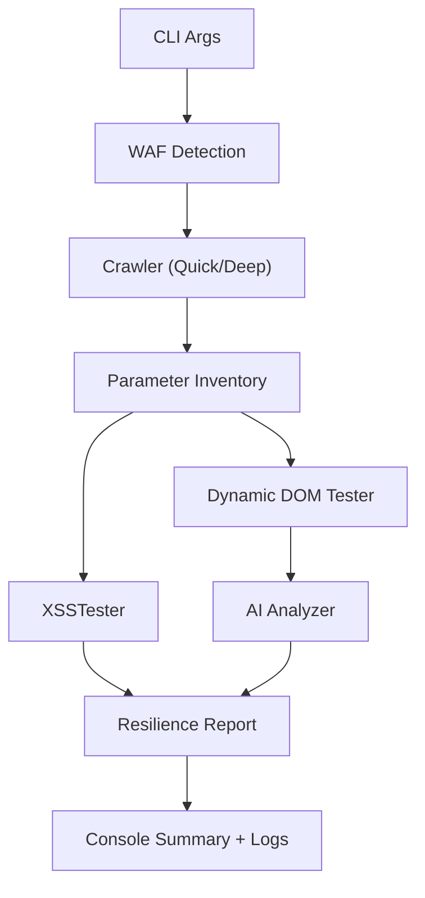
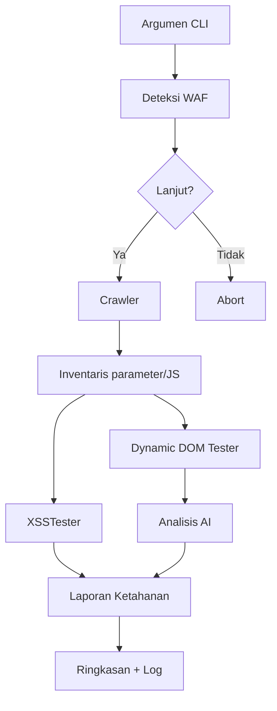

<div align="center">

<!-- TODO: Replace `docs/assets/xss-banner.gif` with the final animated hero banner -->


</div>

---

# XSS Scanner Documentation (English)

## 1. Overview

The **XSS Scanner** is a full-featured assessment suite focused on cross-site scripting discovery and validation. It combines:

- **Hybrid crawling**: static HTML parsing plus Playwright-backed dynamic crawling capable of SPA navigation.
- **Context-aware payload engine** (`payload_strategy.py`): generates adaptive payloads based on sanitization profiles, context hints, and optional WAF plans.
- **Runtime DOM inspection** (`dynamic_dom_tester.py`): collects sink mutations and verifies execution opportunities in client-rendered content.
- **Elastic WAF detection** (`waf_detector.py` + `network.py`): fingerprints common vendors, enforces safe RPS, and guides bypass tactics.
- **AI-assisted triage** (`ai_analysis.py`): integrates with Google GenAI to prioritize findings and suggest remediation when an API key is provided.
- **GraphQL coverage** (`graphql_scanner.py`): enumerates endpoints, introspects schemas, and fuzzes resolvers for XSS vectors.
- **Resilience scoring** (`tester.py` + `resilience.py`): aggregates coverage metrics, confidence, and mitigation checklists for reporting.

> **Intended audience:** Red-team operators, security engineers, and QA teams that require repeatable, high-signal XSS assessments on modern applications.

## 2. Feature Matrix

| Capability | Quick Mode | Deep Mode |
|------------|------------|-----------|
| Static crawling | Yes | Yes |
| Playwright automation | No | Yes |
| Manual login capture | Manual cookie input only | `--manual-login` + persistent session capture |
| Dynamic DOM sink tracing | Yes | Yes |
| AI analysis | Optional (API key) | Optional (API key) |
| GraphQL probing | Optional (`--graphql`) | Optional (`--graphql`) |
| WAF fingerprint & throttling | Yes | Yes |

## 3. Repository Layout

```
- cli.py                  # Entry point & operator UX
- main.py                 # Thin wrapper to launch CLI
- network.py              # HTTP session, jitter, WAF throttle, header camo
- waf_detector.py         # Fingerprinting heuristics & bypass planner
- payload_strategy.py     # SuperBypassEngine & sanitization profiling
- tester.py               # Core testing orchestration & resilience scoring
- dynamic_dom_tester.py   # Runtime sink detection via headless browser
- ai_analysis.py          # Optional GenAI integration
- graphql_scanner.py      # GraphQL endpoint discovery / fuzzing
- crawler/                # Static & advanced (Playwright) crawler implementations
- parsers/                # Context parsers for sink classification
- docs/                   # Additional documentation & evaluation guidance
- waf_fingerprints.yaml   # Fingerprint definitions for common WAF vendors
```

## 4. Installation & Environment

### Requirements

- Python 3.10 or newer.
- `pip` packages from `requirements.txt` (includes Playwright).
- Playwright browsers (Chromium recommended).
- Optional: Google GenAI API key (`GENAI_API_KEY`) for AI analysis.

### Setup

```bash
# Clone
git clone https://github.com/merdekasiberlab/xsscanner.git
cd xsscanner

# Virtual environment (PowerShell)
python -m venv .venv
. .venv/Scripts/Activate.ps1
# For macOS / Linux: source .venv/bin/activate

# Dependencies
pip install -r requirements.txt
python -m playwright install chromium
```

## 5. CLI Usage Reference

```bash
python main.py [options] <target_url>
```

| Flag | Description |
|------|-------------|
| `--mode {quick,deep}` | Quick = static crawler, Deep = Playwright dynamic crawler. |
| `--max-urls N` | Cap total URLs explored. |
| `--depth N` | Recursion depth guard for crawling. |
| `--payloads FILE` | Load additional payloads from YAML file. |
| `--cookie "name=value; ..."` | Inject cookies for authenticated scans. |
| `--manual-login` | Launch headful browser to perform login manually (requires `--login-url`). |
| `--login-url URL` | Login form entry point for manual capture. |
| `--username` / `--password` | Credentials for scripted login in deep mode. |
| `--user-selector`, `--pass-selector`, `--submit-selector` | CSS selectors to customize login automation. |
| `--graphql` | Enable GraphQL endpoint probing. |
| `--api-key KEY` | Google GenAI API key (overrides `GENAI_API_KEY`). |
| `--summary-only` | Suppress verbose output until summary. |
| `--workers N` | Control thread pool size for payload execution. |
| `--insecure` | Disable TLS verification (use cautiously). |

### Typical Workflows

#### Baseline crawl & test
```bash
python main.py --mode quick --max-urls 80 --depth 4 https://target.tld
```

#### Deep scan with manual login & GraphQL coverage
```bash
python main.py \
  --mode deep \
  --manual-login \
  --login-url https://app.tld/login \
  --cookie-file corp-session.json \
  --graphql \
  --max-urls 150 \
  --depth 6 \
  https://app.tld
```

#### AI-guided triage
```bash
set GENAI_API_KEY=your-google-genai-key
python main.py --mode deep --api-key %GENAI_API_KEY% https://portal.tld
```

## 6. WAF Detection & Bypass Strategy

1. `WAFDetector.detect()` probes the origin and redirect chain with HEAD/GET requests. Matches against `waf_fingerprints.yaml` or heuristic patterns.
2. Console displays a friendly notification (e.g., `CloudFront terdeteksi`) with metadata:
   - Confidence level & challenge type (`none`, `js`, `captcha`).
   - Safe requests-per-second and backoff in milliseconds.
   - Matched headers/cookies/body markers.
3. Operator chooses whether to continue. Declining aborts the scan to avoid triggering rate limits or bans.
4. `network.set_waf_throttle()` enforces safe pace and jitter.
5. Payload strategy adapts (e.g., short payloads, reduced inline handlers) based on the `waf_plan` supplied to `tester.py`.

> Customize fingerprints under `waf_fingerprints.yaml` to add proprietary CDN signatures or tweak safe RPS values.

## 7. Crawling & Testing Pipeline



### Module Touchpoints

- **`crawler/advanced_crawler.py`**: orchestrates Playwright sessions, handles login storage state, SPA routing, and throttled navigation.
- **`dynamic_dom_tester.py`**: executes payload probes, collects runtime sinks, and feeds findings back to the tester.
- **`tester.py`**: central engine that schedules payloads, evaluates responses, records contexts, and builds resilience metrics.
- **`payload_strategy.py`**: chooses payload variants based on sanitization, context hints, and WAF plans.
- **`ai_analysis.py`**: optional interactive loop for AI suggestions when runtime sinks are present.

## 8. Logging, Artifacts, and Data Hygiene

- Logs are stored in `logs/xsscanner_<timestamp>.log`. The repository should not commit this directory; ensure it is cleaned before publishing.
- Playwright storage states (e.g., `cookies.json`) may contain credentials; treat them as secrets.
- Test artifacts (screenshots, HAR files) can be produced by enabling debug hooks in `advanced_crawler.py` (commented scaffolding available).

## 9. Testing & Quality Assurance

```bash
# Lint & style
ruff check .

# Type safety
mypy .

# Unit / integration (excluding heavy browser tests)
pytest -m "not playwright"

# Smoke test
python -m compileall cli.py network.py waf_detector.py
python main.py --mode quick --max-urls 5 --depth 2 https://example.com
```

> **Pre-release checklist:**
> - [ ] Clean `logs/`, `__pycache__/`, temp Playwright state.
> - [ ] Run static checks & smoke tests above.
> - [ ] Update `waf_fingerprints.yaml` if new fingerprints were added.
> - [ ] Verify README banner link once final asset is ready.

## 10. Troubleshooting

| Issue | Mitigation |
|-------|------------|
| WAF detection fails to identify vendor | Capture network trace and extend `waf_fingerprints.yaml` with new header/body regex. |
| `PlaywrightError: BrowserType.launch: Executable doesn't exist` | Re-run `python -m playwright install chromium`. |
| Cannot delete log file on Windows | Stop the running scan (Ctrl+C); the log handle is released on exit. |
| AI module raises import error | Install `google-genai` package or run without `--api-key`. |
| High false positives | Use `--summary-only` and manually inspect contexts; adjust payload sets in `payloads.yml`. |

## 12. Legal Notice

- Use this toolkit only against systems you own or have explicit, written authorization to assess.
- You are solely responsible for complying with local laws, regulations, and contractual obligations.
- MerdekaSiberLab and contributors disclaim liability for misuse or damages arising from the operation of this software.

---

# Dokumentasi Pemindai XSS (Bahasa Indonesia)

## 1. Gambaran Umum

**Pemindai XSS** adalah paket asesmen lengkap untuk menemukan dan memvalidasi kerentanan cross-site scripting. Kombinasi fiturnya meliputi:

- **Crawler hibrida**: parser HTML statis ditambah crawler dinamis berbasis Playwright.
- **Mesin payload kontekstual** (`payload_strategy.py`): menghasilkan payload adaptif berdasar profil sanitasi, konteks, dan rencana WAF.
- **Inspeksi DOM runtime** (`dynamic_dom_tester.py`): mendeteksi perubahan sink saat halaman dirender klien.
- **Deteksi WAF adaptif** (`waf_detector.py` + `network.py`): mengenali vendor populer, menghitung batas aman, dan memberi panduan bypass.
- **Analisis berbantuan AI** (`ai_analysis.py`): memanfaatkan Google GenAI untuk triase dan saran mitigasi ketika API key tersedia.
- **Cakupan GraphQL** (`graphql_scanner.py`): memetakan endpoint, introspeksi skema, dan melakukan fuzzing terhadap resolver.
- **Skoring ketahanan** (`tester.py` + `resilience.py`): merangkum tingkat mitigasi, confidence, dan checklist perbaikan.

## 2. Matriks Fitur

| Kemampuan | Mode Quick | Mode Deep |
|-----------|------------|-----------|
| Crawling statis | Ya | Ya |
| Automasi Playwright | Tidak | Ya |
| Tangkap login manual | Cookie manual | `--manual-login` + penyimpanan sesi |
| Pelacakan DOM dinamis | Ya | Ya |
| Analisis AI | Opsional | Opsional |
| GraphQL probing | Opsional (`--graphql`) | Opsional (`--graphql`) |
| Deteksi & throttle WAF | Ya | Ya |

## 3. Struktur Repositori

```
- cli.py                  # Antarmuka pengguna & alur utama
- main.py                 # Pembungkus eksekusi CLI
- network.py              # Manajemen sesi HTTP & throttle WAF
- waf_detector.py         # Fingerprint + rencana bypass
- payload_strategy.py     # Mesin payload adaptif
- tester.py               # Orkestrasi pengujian & skoring ketahanan
- dynamic_dom_tester.py   # Inspeksi DOM runtime
- ai_analysis.py          # Integrasi GenAI opsional
- graphql_scanner.py      # Deteksi & fuzzing GraphQL
- crawler/                # Implementasi crawler statis & dinamis
- parsers/                # Parser konteks sink
- docs/                   # Dokumentasi tambahan & evaluasi
- waf_fingerprints.yaml   # Definisi fingerprint WAF
```

## 4. Instalasi & Lingkungan

### Prasyarat

- Python 3.10 atau lebih baru.
- Dependensi `pip` pada `requirements.txt` (termasuk Playwright).
- Browser Playwright (`python -m playwright install chromium`).
- Opsional: API key Google GenAI (`GENAI_API_KEY`).

### Langkah Setup

```bash
# Kloning
git clone https://github.com/merdekasiberlab/xsscanner.git
cd xsscanner

# Virtual environment (PowerShell)
python -m venv .venv
. .venv/Scripts/Activate.ps1
# macOS / Linux: source .venv/bin/activate

# Install paket
pip install -r requirements.txt
python -m playwright install chromium
```

## 5. Referensi CLI

```bash
python main.py [opsi] <url_target>
```

| Opsi | Penjelasan |
|------|------------|
| `--mode {quick,deep}` | Quick = crawler statis, Deep = crawler dinamis (Playwright). |
| `--max-urls N` | Batas jumlah URL yang dieksplorasi. |
| `--depth N` | Kontrol kedalaman rekursi. |
| `--payloads FILE` | Memuat payload tambahan dari YAML. |
| `--cookie` | Menyuntikkan cookie sesi manual. |
| `--manual-login` | Membuka browser headful untuk login manual (butuh `--login-url`). |
| `--login-url` | URL form login untuk capture manual. |
| `--username` / `--password` | Kredensial untuk login otomatis di mode deep. |
| `--user-selector`, `--pass-selector`, `--submit-selector` | Selector CSS untuk menyesuaikan form login. |
| `--graphql` | Aktifkan pemindaian GraphQL. |
| `--api-key` | API key Google GenAI (override environment variable). |
| `--summary-only` | Menyembunyikan output detail sampai ringkasan akhir. |
| `--workers N` | Jumlah worker thread untuk injeksi payload. |
| `--insecure` | Menonaktifkan verifikasi TLS (gunakan hati-hati). |

### Contoh Alur

#### Pemindaian dasar
```bash
python main.py --mode quick --max-urls 80 --depth 4 https://target.tld
```

#### Pemindaian lanjutan dengan login manual & GraphQL
```bash
python main.py \
  --mode deep \
  --manual-login \
  --login-url https://app.tld/login \
  --cookie-file corp-session.json \
  --graphql \
  --max-urls 150 \
  --depth 6 \
  https://app.tld
```

#### Triase berbantuan AI
```bash
set GENAI_API_KEY=api-key-anda
python main.py --mode deep --api-key %GENAI_API_KEY% https://portal.tld
```

## 6. Deteksi & Bypass WAF

1. `WAFDetector.detect()` melakukan probe HEAD/GET terhadap origin dan chain redirect.
2. Hasil cocok ditampilkan sebagai notifikasi ramah (misal `CloudFront terdeteksi`) beserta metadata throttle.
3. Operator memilih lanjut/tidak; penolakan menghentikan pemindaian.
4. `network.set_waf_throttle()` menerapkan batas laju & jeda sesuai profil.
5. `payload_strategy.py` menyesuaikan strategi (payload pendek, hindari inline handler, dll.).

## 7. Pipeline Crawling & Pengujian



## 8. Logging & Kebersihan Data

- Log berada di `logs/`; hapus sebelum commit atau berbagi.
- File Playwright (contoh `cookies.json`) bersifat sensitif.
- Artefak tambahan (screenshot/HAR) dapat diaktifkan melalui hook debug.

## 9. Pengujian & Quality Gate

```bash
ruff check .
mypy .
pytest -m "not playwright"
python -m compileall cli.py network.py waf_detector.py
python main.py --mode quick --max-urls 5 --depth 2 https://example.com
```

Checklist sebelum rilis:
- [ ] Bersihkan `logs/`, `__pycache__/`, state Playwright.
- [ ] Jalankan lint, type check, dan smoke test.
- [ ] Perbarui fingerprint jika ada vendor baru.
- [ ] Ganti banner placeholder dengan aset final.

## 10. Pemecahan Masalah

| Masalah | Solusi |
|---------|--------|
| Fingerprint WAF tidak dikenali | Tambahkan pola baru ke `waf_fingerprints.yaml`. |
| Playwright gagal launch | Jalankan `python -m playwright install chromium`. |
| File log tidak bisa dihapus | Hentikan proses pemindaian (Ctrl+C). |
| Modul AI error | Pasang dependensi GenAI atau jalankan tanpa `--api-key`. |
| False positive tinggi | Tinjau konteks secara manual, sesuaikan payload pada `payloads.yml`. |

## 11. Roadmap & Ekstensi

- Integrasi OAST otomatis (`oast.py`).
- Dukungan fingerprint kustom via konfigurasi remote.
- Ekspor laporan (SARIF/HTML) dengan menghidupkan kembali blok artefak di `cli.py`.
- Otomasi CI/CD (GitHub Actions) dengan pengelolaan secret.

## 12. Catatan Hukum

- Gunakan toolkit ini hanya pada sistem milik sendiri atau yang telah memberi izin tertulis dan eksplisit.
- Tanggung jawab kepatuhan terhadap hukum, regulasi, dan perjanjian sepenuhnya berada pada pengguna.
- MerdekaSiberLab dan para kontributor tidak bertanggung jawab atas penyalahgunaan maupun kerugian yang timbul dari penggunaan perangkat lunak ini.

---