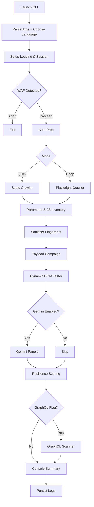
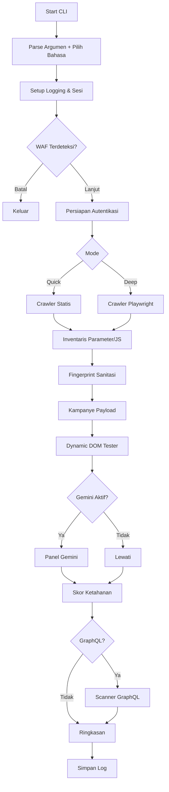

<div align="center">


[](https://github.com/merdekasiberlab/xsscanner)

</div>

---

# XSSSGENAI – English Edition

> **Mission**: Deliver a repeatable, insight-rich XSS assessment on modern applications by blending context-aware payloads, adaptive crawling, WAF intelligence, and Gemini-assisted triage.

## Contents
1. [Quick Facts](#1-quick-facts)
2. [Core Capabilities](#2-core-capabilities)
3. [Architecture & Module Map](#3-architecture--module-map)
4. [Processing Pipeline](#4-processing-pipeline)
5. [Installation & Environment Setup](#5-installation--environment-setup)
6. [Configuration & Extensibility](#6-configuration--extensibility)
7. [Operating the CLI](#7-operating-the-cli)
8. [Payload & Testing Strategy](#8-payload--testing-strategy)
9. [WAF-Aware Workflow](#9-waf-aware-workflow)
10. [Gemini AI Companion](#10-gemini-ai-companion)
11. [Resilience Metrics & Reporting](#11-resilience-metrics--reporting)
12. [Logs, Data Hygiene & Export](#12-logs-data-hygiene--export)
13. [Troubleshooting & FAQ](#13-troubleshooting--faq)
14. [Roadmap & Contributions](#14-roadmap--contributions)
15. [Legal Notice](#15-legal-notice)

---

## 1. Quick Facts
| Item | Details |
|------|---------|
| Product Name | **XSSSGENAI** (MerdekaSiberLab Access-X initiative) |
| Focus | Cross-Site Scripting discovery, verification, and prioritisation |
| Supported Targets | SSR, SPA, and hybrid applications (desktop or mobile web) |
| Execution Modes | `quick` (static crawler) / `deep` (Playwright crawler) |
| Languages | English & Bahasa Indonesia (selectable at launch) |
| AI Integration | Optional Google Gemini analysis (`GENAI_API_KEY`) |

## 2. Core Capabilities
- **Hybrid Crawling** – deterministic HTML traversal plus Playwright-driven session for SPA states, gated flows, and dynamic components.
- **Context-Aware Payload Engine** – `payload_strategy.py` fingerprints sanitisation responses, aligning payloads to HTML, attribute, JS, URL, CSS, and SVG contexts.
- **Dynamic DOM Tester** – `dynamic_dom_tester.py` leverages Playwright to capture runtime sink mutations, event handler attachment, and alert channels.
- **WAF Detection & Bypass Guidance** – `waf_detector.py` cross-references headers, cookies, and body markers to identify vendors, throttle limits, and bypass tips.
- **Gemini Intelligence Layer** – `ai_analysis.py` builds clean multi-part prompts for Google GenAI, outputting ranked sinks, exploit ladders, and mitigations in Rich panels.
- **GraphQL Reconnaissance** – `graphql_scanner.py` discovers endpoints, performs introspection, and fuzzes resolver arguments for XSS surfaces.
- **Resilience Scoring** – `tester.py` + `resilience.py` quantify defensive posture via CSP/Trusted Types probes, sink coverage, and confirmed payload execution.

## 3. Architecture & Module Map
```
cli.py                  # CLI UX, orchestration, language selection
main.py                 # Entry shim
network.py              # Session handling, retries, pacing, WAF throttle
waf_detector.py         # Fingerprints + bypass planner
payload_strategy.py     # Context fingerprinting & payload generation
dynamic_dom_tester.py   # Playwright instrumentation for runtime sinks
tester.py               # Payload execution, resilience aggregation
ai_analysis.py          # Gemini prompts, Rich rendering
graphql_scanner.py      # Endpoint enumeration & resolver fuzzing
crawler/                # Static BFS + advanced Playwright crawlers
parsers/                # Context parsers (HTML, attributes, JS, DOM)
docs/                   # Extra documentation & evaluation artefacts
waf_fingerprints.yaml   # Vendor signatures
i18n.py                 # Translation registry and helper utilities
```

### 3.1 Module Responsibilities
| Module | Inputs | Core Logic | Outputs |
|--------|--------|------------|---------|
| `cli.py` | CLI args, language selection | Orchestrates scan workflow, renders Rich UI | Payload results, AI panels, resilience summary |
| `network.py` | Session config, WAF profile | Request pacing, jitter, retry/backoff | HTTP responses with enforced throttle |
| `payload_strategy.py` | Sanitiser map, WAF hints | Tailors payload templates per context | Context-specific payload sets |
| `dynamic_dom_tester.py` | Target pages, Playwright context | Runs headless evaluation, captures sinks | Runtime findings (events/mutations) |
| `tester.py` | Payload sets, runtime data | Executes payload campaigns, tracks hits | Confirmed vulns, resilience signals |
| `ai_analysis.py` | HTML snapshots, JS snippets, runtime JSON | Assembles Gemini prompt & renders Rich panels | Sectioned analysis (summary, exploit paths, etc.) |
| `graphql_scanner.py` | Base URL, session | Enumerates endpoints, introspects schema | GraphQL findings & fuzz results |

## 4. Processing Pipeline
1. **Input & Language Prompt** – parse CLI flags, display available languages, set translation scope via `_prompt_language_choice()`.
2. **Logging Configuration** – initialise Rich console/file logging based on `--summary-only`.
3. **Session Preparation** – configure `network.session` (cookies, headers, proxies, UA overrides).
4. **WAF Fingerprinting** – optional HEAD/GET probes via `waf_detector.detect()`; surface vendor metadata, safe RPS/backoff, and bypass hints.
5. **Authentication Setup** – manual Playwright login (`--manual-login`) or scripted credentials prepare an authenticated session.
6. **Crawling Stage**
   - *Quick Mode*: static BFS enumerates anchors/forms/scripts up to `--depth`, `--max-urls`.
   - *Deep Mode*: Playwright crawler navigates SPA routes, capturing dynamic DOM states.
7. **Inventory Building** – aggregate parameter candidates and external JS targets.
8. **Sanitisation Fingerprinting** – baseline reflection tests classify character handling, encoded values, filtered sets.
9. **Payload Execution** – contextual payload batches executed via `tester.py`, tracking reflection vs execution.
10. **Dynamic DOM Pass** – Playwright headless run inspects runtime sinks, event attachments, alerts.
11. **Optional Gemini Run** – `ai_analysis.py` processes curated HTML/JS/runtime data; renders Rich panels with exploit reasoning.
12. **Resilience Aggregation** – compile CSP/Trusted Types coverage, mutated sinks, confirmed payloads into a 0–100 score.
13. **GraphQL Module (Optional)** – discover endpoints, introspect schema, fuzz resolver arguments.
14. **Summary & Logging** – display executed payloads, resilience checklists, AI output; write structured logs to `logs/`.

### 4.1 Visual Flow


## 5. Installation & Environment Setup
### 5.1 Clone & Virtual Environment
```bash
git clone https://github.com/merdekasiberlab/xsscanner.git
cd xsscanner
python -m venv .venv
# Windows PowerShell"). .venv/Scripts/Activate.ps1"
# macOS/Linux
source .venv/bin/activate
```

### 5.2 Dependencies
```bash
pip install --upgrade pip
pip install -r requirements.txt
python -m playwright install chromium
```

### 5.3 Developer Utilities
```bash
pip install -r requirements-dev.txt
ruff check .
mypy .
pytest -m "not playwright"
```

### 5.4 Environment Variables
| Variable | Purpose |
|----------|---------|
| `GENAI_API_KEY` | Google GenAI key for Gemini integration. |
| `HTTP_PROXY`, `HTTPS_PROXY` | Proxy configuration for outbound requests. |
| `XSSCANNER_USER_AGENT` | Override default scanner user-agent string. |

## 6. Configuration & Extensibility
- **`config.py`** – logger path, default depth/URL caps, crawler knobs.
- **`waf_fingerprints.yaml`** – extend to capture new vendors or custom appliances.
- **`payloads.yml`** – merge custom payload sets (per context).
- **`i18n.py`** – add phrases when extending CLI dialogue.
- **`docs/`** – store internal evaluation notes or compliance addenda.

## 7. Operating the CLI
### 7.1 Syntax
```bash
python main.py [OPTIONS] <target_url>
```

### 7.2 Common Options
| Flag | Description |
|------|-------------|
| `--mode {quick,deep}` | Static vs Playwright crawler. |
| `--max-urls N` | Limit total discovered URLs. |
| `--depth N` | BFS depth guard. |
| `--payloads FILE` | Merge payload YAML. |
| `--cookie "key=value;..."` | Inject cookies. |
| `--manual-login` | Headful session capture. |
| `--login-url URL` | Login page for manual capture. |
| `--username`, `--password` | Scripted credentials (deep mode). |
| `--user-selector`, `--pass-selector`, `--submit-selector` | Custom login selectors. |
| `--graphql` | Enable GraphQL reconnaissance. |
| `--api-key KEY` | Supply Gemini key (overrides env). |
| `--summary-only` | Suppress intermediate noise. |
| `--workers N` | Thread pool for payloads. |
| `--insecure` | Disable TLS verification. |

### 7.3 Cookbook Workflows
1. **Rapid Recon**
   ```bash
   python main.py --mode quick --max-urls 60 --depth 4 https://target.tld
   ```
2. **Deep Scan + Manual Login + GraphQL**
   ```bash
   python main.py \
     --mode deep \
     --manual-login \
     --login-url https://portal.tld/login \
     --cookie-file corp-session.json \
     --graphql \
     --max-urls 150 \
     --depth 6 \
     https://portal.tld
   ```
3. **Gemini Triage Session**
   ```bash
   set GENAI_API_KEY=your-google-genai-key
   python main.py --mode deep --api-key %GENAI_API_KEY% https://app.tld
   ```

### 7.4 JS Analysis Menu
- Ranked by sink count, context diversity, and file size.
- Options: quick summary, full Gemini review, or skip per file.
- Quick summary displays top sink labels and truncated snippets.

## 8. Payload & Testing Strategy
- **Fingerprint-Driven** – baseline reflections classify characters as filtered, encoded, or reflected.
- **Context Sequencing** – payloads escalate from benign reflections to DOM execution and alert-based detection.
- **WAF Adjustments** – short payloads, attribute minimisation, inline-handler avoidance triggered by WAF profile.
- **Dynamic Verification** – runtime event triggers, timers, storage, and location-based sinks validated via Playwright.

## 9. WAF-Aware Workflow
- Vendor metadata includes origin, confidence, challenge type, safe RPS, and recommended backoff.
- CLI prompt allows aborting scans on sensitive infrastructure.
- `network.py` enforces throttle globally; payload engine applies bypass tactics.

## 10. Gemini AI Companion
- Prompt includes HTML snapshots, sanitiser map, runtime findings, and curated JS snippets.
- Rich panels summarise: high-level risk, evidence, ranked exploit paths, payload ladder, mitigations, validation plan.
- Follow-up loop enables repeated analysis with refreshed JS or ad-hoc questions.

## 11. Resilience Metrics & Reporting
- Score (0–100) summarises observed defences vs confirmed issues.
- Checklist items highlight immediate improvements.
- Pair output with AI summaries for stakeholder reporting.

## 12. Logs, Data Hygiene & Export
- Per-run logs under `logs/`; purge before sharing.
- Playwright storage (`cookies.json`, storage state) may contain secrets.
- Export Rich panels or resilience summary via copy/paste or `tee` piping.

## 13. Troubleshooting & FAQ
| Problem | Resolution |
|---------|------------|
| WAF fingerprint missing | Extend `waf_fingerprints.yaml` with new regex signatures. |
| Playwright launch failure | `python -m playwright install chromium`. |
| Gemini import error | `pip install google-genai` or omit `--api-key`. |
| High false positives | Review context, tune `payloads.yml`. |
| Scan throttled by WAF | Accept suggested RPS, lower `--max-urls`, or start in quick mode. |
| Locked logs on Windows | Stop scan (Ctrl+C); file handle closes on exit. |

## 14. Roadmap & Contributions
- Upcoming: automated OAST callbacks, remote fingerprint feeds, HTML/SARIF report exporters, CI smoke-test pipeline.
- Contributions welcome: run `ruff`, `mypy`, relevant tests before PR; add translations to `i18n.py` as needed.

## 15. Legal Notice
Operate only on systems you own or have explicit written permission to test. Compliance with applicable laws, regulations, and contracts rests with you. MerdekaSiberLab and contributors disclaim liability for misuse or resulting damages.

---

# XSSSGENAI – Versi Bahasa Indonesia

> **Misi**: Menyajikan asesmen XSS yang dapat diulang dan kaya insight pada aplikasi modern melalui payload kontekstual, crawling adaptif, intelijen WAF, dan triase Gemini.

## Daftar Isi
1. [Ringkasan Singkat](#1-ringkasan-singkat)
2. [Kemampuan Inti](#2-kemampuan-inti)
3. [Arsitektur & Peta Modul](#3-arsitektur--peta-modul)
4. [Alur Proses](#4-alur-proses)
5. [Instalasi & Setup Lingkungan](#5-instalasi--setup-lingkungan)
6. [Konfigurasi & Ekstensibilitas](#6-konfigurasi--ekstensibilitas)
7. [Mengoperasikan CLI](#7-mengoperasikan-cli)
8. [Strategi Payload & Pengujian](#8-strategi-payload--pengujian)
9. [Alur Sadar-WAF](#9-alur-sadar-waf)
10. [Pendamping AI Gemini](#10-pendamping-ai-gemini)
11. [Metri Ketahanan & Pelaporan](#11-metri-ketahanan--pelaporan)
12. [Log, Kebersihan Data & Ekspor](#12-log-kebersihan-data--ekspor)
13. [Troubleshooting & FAQ](#13-troubleshooting--faq)
14. [Roadmap & Kontribusi](#14-roadmap--kontribusi)
15. [Catatan Hukum](#15-catatan-hukum)

---

## 1. Ringkasan Singkat
| Item | Detail |
|------|--------|
| Nama Produk | **XSSSGENAI** (inisiatif MerdekaSiberLab Access-X) |
| Fokus | Penemuan, verifikasi, dan prioritas celah XSS |
| Target | Aplikasi SSR, SPA, maupun hybrid |
| Mode Eksekusi | `quick` (crawler statis) / `deep` (crawler Playwright) |
| Bahasa | Inggris & Bahasa Indonesia (dipilih saat startup) |
| Integrasi AI | Opsional Google Gemini (`GENAI_API_KEY`) |

## 2. Kemampuan Inti
- **Crawling Hibrida** – kombinasi traversing HTML deterministik dan sesi Playwright untuk SPA, alur login, konten dinamis.
- **Mesin Payload Kontekstual** – `payload_strategy.py` mengidentifikasi perilaku sanitasi dan menyesuaikan payload untuk konteks HTML, atribut, JS, URL, CSS, SVG.
- **Dynamic DOM Tester** – `dynamic_dom_tester.py` memanfaatkan Playwright untuk menangkap mutasi sink runtime, event handler, serta saluran alert.
- **Deteksi & Panduan WAF** – `waf_detector.py` menggabungkan sinyal header, cookie, body guna mengenali vendor, batas throttle, dan saran bypass.
- **Inteligensi Gemini** – `ai_analysis.py` menyusun prompt bersih untuk Google GenAI, memunculkan panel Rich berisi ranking sink, ladder payload, dan mitigasi.
- **Rekon GraphQL** – `graphql_scanner.py` memetakan endpoint, melakukan introspeksi, serta fuzzing argumen resolver untuk permukaan XSS.
- **Skor Ketahanan** – `tester.py` + `resilience.py` mengukur ketahanan lewat CSP/Trusted Types, cakupan sink, dan payload terkonfirmasi.

## 3. Arsitektur & Peta Modul
```
cli.py                  # UX CLI, orkestrasi, pemilihan bahasa
main.py                 # Pembungkus entry minimal
network.py              # Manajemen sesi, retry, pacing, throttle WAF
waf_detector.py         # Fingerprint vendor + rencana bypass
payload_strategy.py     # Fingerprint sanitasi & generator payload
dynamic_dom_tester.py   # Instrumentasi Playwright untuk sink runtime
tester.py               # Eksekusi payload, agregasi ketahanan
ai_analysis.py          # Prompt Gemini, panel Rich
graphql_scanner.py      # Enumerasi endpoint & fuzz resolver
crawler/                # Crawler BFS statis + varian Playwright
parsers/                # Parser konteks (HTML, atribut, JS, DOM)
docs/                   # Dokumentasi & artefak evaluasi
waf_fingerprints.yaml   # Signature vendor WAF
i18n.py                 # Registry terjemahan & utilitas bantu
```

### 3.1 Tanggung Jawab Modul
| Modul | Input | Logika Inti | Output |
|-------|-------|-------------|--------|
| `cli.py` | Argumen CLI, pilihan bahasa | Mengorkestrasi alur scan, menampilkan Rich UI | Hasil payload, panel AI, ringkasan ketahanan |
| `network.py` | Konfigurasi sesi, profil WAF | Pacing request, jitter, retry/backoff | Respons HTTP dengan throttle |
| `payload_strategy.py` | Peta sanitasi, hint WAF | Menyesuaikan template payload per konteks | Set payload spesifik konteks |
| `dynamic_dom_tester.py` | URL target, konteks Playwright | Evaluasi headless, menangkap sink | Temuan runtime (event/mutasi) |
| `tester.py` | Set payload, data runtime | Menjalankan kampanye payload, mencatat hit | Vuln terkonfirmasi, sinyal ketahanan |
| `ai_analysis.py` | Snapshot HTML, snippet JS, runtime JSON | Menyusun prompt Gemini, merender Rich panel | Analisis terstruktur (ringkasan, exploit path, dsb.) |
| `graphql_scanner.py` | URL dasar, sesi | Enumerasi endpoint, introspeksi skema | Temuan GraphQL & hasil fuzz |

## 4. Alur Proses
1. **Input & Pilihan Bahasa** – parsing flag CLI, menampilkan bahasa, mengatur cakupan terjemahan via `_prompt_language_choice()`.
2. **Konfigurasi Logging** – inisialisasi Rich console/file sesuai `--summary-only`.
3. **Persiapan Sesi** – mengonfigurasi `network.session` (cookie, header, proxy, UA).
4. **Fingerprint WAF** – opsi HEAD/GET melalui `waf_detector.detect()`; menampilkan metadata vendor, RPS aman, backoff, hint bypass.
5. **Persiapan Autentikasi** – login headful Playwright (`--manual-login`) atau kredensial scripted menyiapkan sesi autentik.
6. **Tahap Crawling**
   - *Mode Quick*: BFS statis menelusuri anchor/form/script hingga `--depth`, `--max-urls`.
   - *Mode Deep*: crawler Playwright menelusuri route SPA, menangkap state DOM dinamis.
7. **Inventaris** – mengumpulkan parameter dan target JS eksternal.
8. **Fingerprint Sanitasi** – uji refleksi baseline untuk klasifikasi karakter (filtered, encoded, reflected).
9. **Eksekusi Payload** – kampanye payload kontekstual via `tester.py`, memisahkan refleksi vs eksekusi.
10. **Dynamic DOM Pass** – Playwright headless memeriksa sink runtime, event handler, alert.
11. **Analisis Gemini Opsional** – `ai_analysis.py` memproses HTML/JS/runtime, menampilkan panel Rich.
12. **Agregasi Ketahanan** – menghimpun sinyal proteksi dan payload sukses menjadi skor 0–100.
13. **Modul GraphQL Opsional** – enumerasi endpoint, introspeksi skema, fuzz argumen resolver.
14. **Ringkasan & Logging** – menampilkan payload tereksekusi, checklist ketahanan, output AI; menulis log ke `logs/`.

### 4.1 Diagram Alir


## 5. Instalasi & Setup Lingkungan
### 5.1 Kloning & Virtual Environment
```bash
git clone https://github.com/merdekasiberlab/xsscanner.git
cd xsscanner
python -m venv .venv
# Windows PowerShell"). .venv/Scripts/Activate.ps1"
# macOS/Linux
source .venv/bin/activate
```

### 5.2 Dependensi
```bash
pip install --upgrade pip
pip install -r requirements.txt
python -m playwright install chromium
```

### 5.3 Utilitas Pengembang
```bash
pip install -r requirements-dev.txt
ruff check .
mypy .
pytest -m "not playwright"
```

### 5.4 Variabel Lingkungan
| Variabel | Fungsi |
|----------|--------|
| `GENAI_API_KEY` | API key Google GenAI untuk integrasi Gemini. |
| `HTTP_PROXY`, `HTTPS_PROXY` | Konfigurasi proxy keluar. |
| `XSSCANNER_USER_AGENT` | Mengganti user-agent default scanner. |

## 6. Konfigurasi & Ekstensibilitas
- **`config.py`** – jalur log, default kedalaman/batas URL, parameter crawler.
- **`waf_fingerprints.yaml`** – perluas untuk vendor atau perangkat kustom.
- **`payloads.yml`** – gabungkan payload kustom per konteks.
- **`i18n.py`** – tambahkan kosakata baru untuk dialog CLI.
- **`docs/`** – simpan catatan evaluasi internal atau lampiran kepatuhan.

## 7. Mengoperasikan CLI
### 7.1 Sintaks
```bash
python main.py [OPSI] <url_target>
```

### 7.2 Opsi Umum
| Flag | Penjelasan |
|------|------------|
| `--mode {quick,deep}` | Memilih crawler statis atau Playwright. |
| `--max-urls N` | Batas total URL yang ditemukan. |
| `--depth N` | Pengaman kedalaman BFS. |
| `--payloads FILE` | Menggabungkan YAML payload. |
| `--cookie "k=v;..."` | Menyuntikkan cookie. |
| `--manual-login` | Capture sesi headful. |
| `--login-url URL` | Halaman login untuk capture manual. |
| `--username`, `--password` | Kredensial ter-script (mode deep). |
| `--user-selector`, `--pass-selector`, `--submit-selector` | Menyesuaikan selector login. |
| `--graphql` | Aktifkan pemindaian GraphQL. |
| `--api-key KEY` | Menyediakan key Gemini (override env). |
| `--summary-only` | Menyembunyikan noise sementara. |
| `--workers N` | Thread pool eksekusi payload. |
| `--insecure` | Menonaktifkan verifikasi TLS. |

### 7.3 Skenario Praktis
1. **Rekon cepat**
   ```bash
   python main.py --mode quick --max-urls 60 --depth 4 https://target.tld
   ```
2. **Scan mendalam + login manual + GraphQL**
   ```bash
   python main.py \
     --mode deep \
     --manual-login \
     --login-url https://portal.tld/login \
     --cookie-file corp-session.json \
     --graphql \
     --max-urls 150 \
     --depth 6 \
     https://portal.tld
   ```
3. **Sesi triase Gemini**
   ```bash
   set GENAI_API_KEY=api-key-anda
   python main.py --mode deep --api-key %GENAI_API_KEY% https://app.tld
   ```

### 7.4 Menu Analisis JS
- Diperingkat oleh jumlah sink, keragaman konteks, ukuran file.
- Opsi: ringkasan cepat, evaluasi Gemini penuh, atau lewati per file.
- Ringkasan cepat menampilkan label sink dan snippet terpotong.

## 8. Strategi Payload & Pengujian
- **Berbasis Fingerprint** – refleksi baseline mengklasifikasi karakter (filtered, encoded, reflected).
- **Sequencing Kontekstual** – payload meningkat bertahap dari refleksi aman hingga eksekusi DOM.
- **Penyesuaian WAF** – payload pendek, minimisasi atribut, hindari handler inline berdasar profil WAF.
- **Verifikasi Dinamis** – event runtime, timer, storage, dan sink berbasis lokasi divalidasi via Playwright.

## 9. Alur Sadar-WAF
- Metadata vendor mencakup origin, confidence, jenis tantangan, RPS aman, rekomendasi backoff.
- CLI memberi opsi berhenti untuk infrastruktur sensitif.
- `network.py` menerapkan throttle global; mesin payload mengaktifkan taktik bypass.

## 10. Pendamping AI Gemini
- Prompt memuat snapshot HTML, peta sanitasi, temuan runtime, snippet JS terkurasi.
- Panel Rich merangkum: ringkasan risiko, bukti, jalur eksploit, ladder payload, mitigasi, rencana validasi.
- Loop tindak lanjut memungkinkan analisis ulang dengan JS terbaru atau pertanyaan adhoc.

## 11. Metri Ketahanan & Pelaporan
- Skor (0–100) merangkum proteksi yang teramati vs payload sukses.
- Checklist menyoroti langkah cepat.
- Gabungkan dengan ringkasan AI untuk laporan stakeholder.

## 12. Log, Kebersihan Data & Ekspor
- Log per run di `logs/`; bersihkan sebelum dibagikan.
- Penyimpanan Playwright (`cookies.json`, storage state) mungkin memuat rahasia.
- Ekspor panel Rich atau ringkasan ketahanan via copy/paste atau piping `tee`.

## 13. Troubleshooting & FAQ
| Masalah | Solusi |
|---------|--------|
| Fingerprint WAF belum ada | Perluas `waf_fingerprints.yaml` dengan signature baru. |
| Playwright gagal launch | `python -m playwright install chromium`. |
| Modul Gemini error | `pip install google-genai` atau jalankan tanpa `--api-key`. |
| False positive tinggi | Tinjau konteks, sesuaikan `payloads.yml`. |
| Scan melambat karena WAF | Ikuti RPS yang disarankan, turunkan `--max-urls`, mulai dari mode quick. |
| Log terkunci (Windows) | Hentikan scan (Ctrl+C); handle tertutup saat exit. |

## 14. Roadmap & Kontribusi
- Agenda: integrasi callback OAST otomatis, feed fingerprint jarak jauh, exporter HTML/SARIF, pipeline smoke-test CI.
- Kontribusi via pull request: jalankan `ruff`, `mypy`, dan pengujian terkait; tambahkan terjemahan di `i18n.py` bila perlu.

## 15. Catatan Hukum
Gunakan toolkit hanya pada sistem milik sendiri atau yang memiliki izin tertulis eksplisit. Kepatuhan hukum, regulasi, dan kontrak sepenuhnya berada pada pengguna. MerdekaSiberLab beserta kontributor tidak menanggung tanggung jawab atas penyalahgunaan atau kerugian yang timbul.

---
